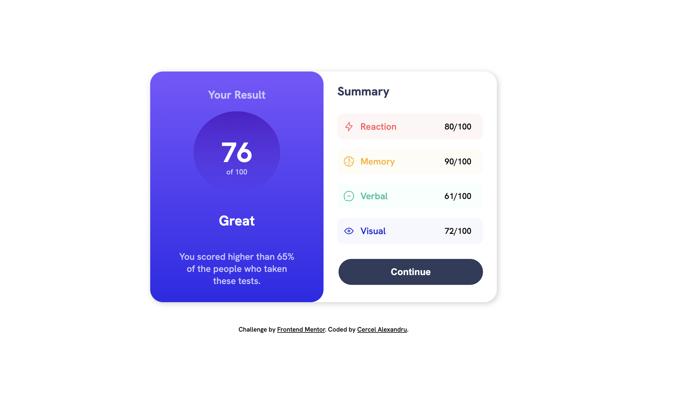

# Frontend Mentor - Results summary component solution

## Table of contents

- [The challenge](#the-challenge)
- [Screenshot](#screenshot)
- [Links](#links)
- [My process](#my-process)
- [Built with](#built-with)
- [What I learned](#what-i-learned)
- [Continued development](#continued-development)
- [Useful resources](#useful-resources)
- [Author](#author)

### The challenge

The challange given by Frontend mentor has helped me to stregnhten my knowledge of HTML, CSS and Javascript. I have learned a different approach of how to store dynamicly into the project which helped me to dive even deeper into it. I m am aware that this might not be a close design to the one from the challange, but i am looking to practice code, not to copy it. I am looking forward to get feedback from you guys and to improve my skills even more. Thank you for your time and have a great day!

### Screenshot

### Links

- Solution URL: (https://github.com/Alez05/result-summary-component.git)
- Live Site URL: (https://resultsumarycomponent.netlify.app)

## My process

I firstly went over the design and analize it to make an idea of how it should look. I approached a kind of reusable library for colors, which helped me not to always look for the colors I needed. Then i cracked on with the components, i spent quite a while finding names for each part of it but it was fun to get trhoug it. For styling, I still need to learn more about css grid and how to approach it in the future, but for now i stick wiht the basics.

### Built with

- Semantic HTML5 markup
- CSS custom properties
- Javascript
- Flexbox

### What I learned

I have learned how to store dynamically the data into a project and how to approach it in the future.

### Continued development

I would consider diving deeper into css grid to make the website even more responsive without using to many css properites. I will also consider looking more into Javascript to make the website more interactive and to make it more user friendly.

### Useful resources

- [Web Dev Simplified](https://youtu.be/cuEtnrL9-H0?si=CeYjZdLALF7SzECF) - This helped me how to fetch data into a project and gave me a understanding on how I should approach it in the future, i have learned also the difference between appendChild, append, innerHtml, textContent and how to use them. I really liked this pattern and will use it going forward.

## Author

- Frontend Mentor - [@Alez05](https://www.frontendmentor.io/profile/Alez05)
- Github - [@Alez05](https://github.com/Alez05)
- Linkdin - [Alexandru Cercel](https://www.linkedin.com/in/alexandru-cercel-6b977b220/)
